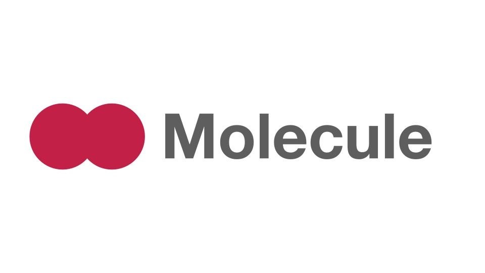

# Molecule


CSS like a molecule.

# How to use?

### npm

```sh
npm install molecule-css
```

### Yarn

```sh
yarn add molecule-css
```

### CDN(From npm)

```html
<link rel="stylesheet" href="https://cdn.jsdelivr.net/npm/molecule-css@latest/css/molecule.min.css">
```

### CDN(From GitHub)

```html
<link rel="stylesheet" href="https://cdn.jsdelivr.net/gh/risuney/molecule-css@latest/css/molecule.min.css">
```
