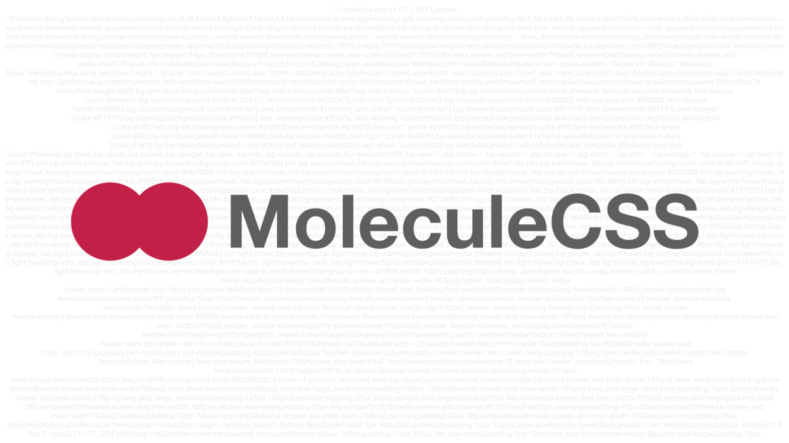

# MoleculeCSS


Simple and modern CSS framework

# How to use

### npm

```sh
npm install molecule-css
```

or

### Yarn

```sh
yarn add molecule-css
```

### CDN

```html
<link rel="stylesheet" href="https://unpkg.com/molecule-css@latest/css/molecule.min.css">
```
